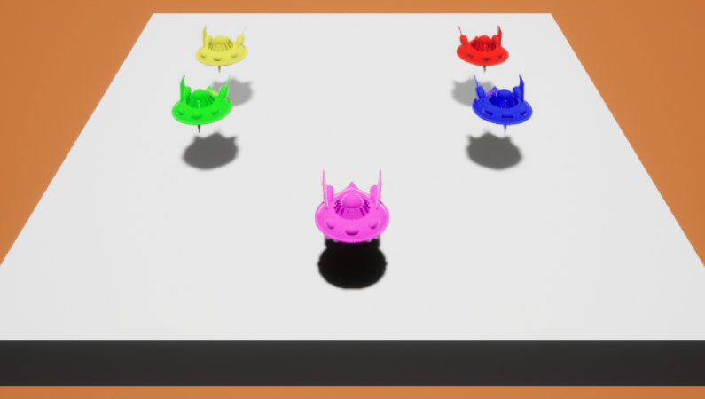
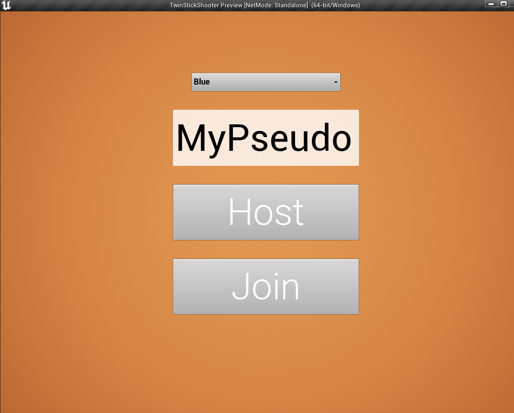
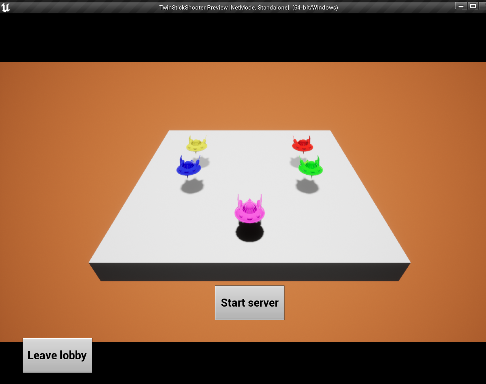
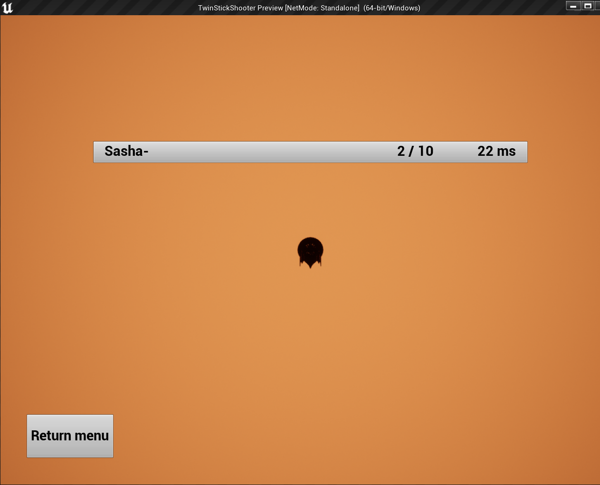
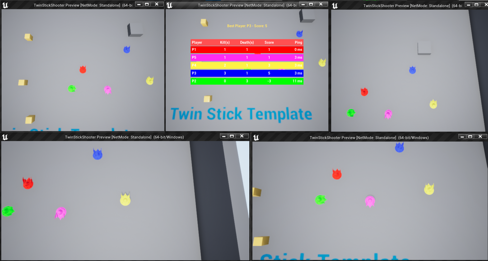

# *LERE*: *Network Twin Stick Shooter* - **Unity/C#**
### ISART DIGITAL GP3, School Project: *Rémi GINER, Sasha LEGRAND* 

 

 

<!-- ABOUT THE PROJECT -->
# About The Project 
**Built with Unreal Engine 4.27.2**

The goal of this project was to implement *Networking* in the **Unreal Engine 4.27** **Twin Stick Shooter** template.

# Table of contents
1. [Features & usage](#features--usage)
    - [Features](#features)
    - [Controls](#controls)
3. [How to launch](#how-to-launch)
5. [Details](#details)
    - [Project overview](#project-overview)
    - [Movement replication](#movement-replication)
    - [Shots replication](#shots-replication)
    - [Game and players info](#game-and-players-info)
5. [Reference](#references)
6. [Versionning](#versionning)
6. [Autors](#authors)

# Features & usage

## Features
- Hosting a network session
- Joining a network session
- Replicating players movements and shots
- Replicating the physics of objects
- Sharing players information and settings

## Controls
The controls are made for keyboard only:
- ***WASD*** - Move
- ***Up/Down/Left/Right arrows*** - Directional shot
- ***Tab*** - Show player scores
- ***Escape*** - Pause (Only in a game session)

# How to launch
Launch the exe directly from the archive.

# Details

## Project Overview

After launching the application, you will fall on a simple menu. This is where you will be able to **create your network session** or **join an existing one**. Simply set your *player settings* (pseudo, color) and click on a button to start

 

When clicking on the **Host** button, a network session is created and you fall on a lobby room, waiting for you to launch the game. All the connected players will appear here.\
You can change the score to reach to win, start the game session by clicking the "*StartServer*" button or delete it by clicking the "*LeaveLobby*" button.

 

When clicking on the **Join** button, you will have access to all the available sessions on the server. You can select any session and join it to play with other players.

> **Note:** If the session is already started (not on the lobby room), joining will automatically make you spawn in the game map.

 

## Session system
To create and join sessions, we are using the built-in *OnlineSubSystem*. You can join a session even if its already started, leave a session whenever you want.

> Note: If the session host leave the game, every clients will be kicked to the main menu.

## Movement replication
To allow the player to move and see it on the other clients, the movement needed to be replicated.\
To work, the client apply its movement locally and tell the server what he does. The server take the movement information and apply it locally. If the difference between the server position and the client position is too high (due to a server or client lag), the server resnap the client to keep the logic between the two instances.

 

> Note: The blue error message on screen is shown when a snap is asked by the server

## Shots replication
To allow the player to fire shots, shots also needed to be replicated.\
When a client is trying to shoot, he tell the server to launch a multicast RPC to the tell everyone to spawn a bullet with a given position, direction and speed.

It is important to know that only the server bullet is a "*real*" bullet. The bullet spawned on the client side is only virtual and will never affect the game. (In case there is a lag, avoid cheats)

When a client is hit (by the server), the client takes damages and died if its life is down to zero. Then, we ask the server to disable the client pawn on all the clients and respawn it after a given delay.

 

## Game and players info
All the current game data is stored in the server game instance and game mode. When a player is killed, the score is first updated on the server and then the server share this to the clients. In the game mode, when the server see a client reaching the game maximum score, the game is set over and the host can close the lobby or relaunch a new game.

Also, all the clients personal information are stored in a *PlayerState* class to easily get some parke thameters lie name or the color of the client and apply them in the game.

 

# References:
- Unreal Engine Doc : [Actors Replication](https://docs.unrealengine.com/4.27/en-US/InteractiveExperiences/Networking/Actors/)

# Versionning
Git Lab for the versioning.

# Authors
* **Rémi GINER**
* **Sasha LEGRAND**